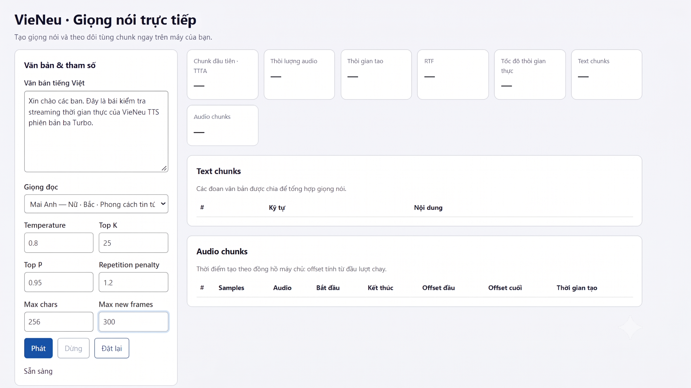
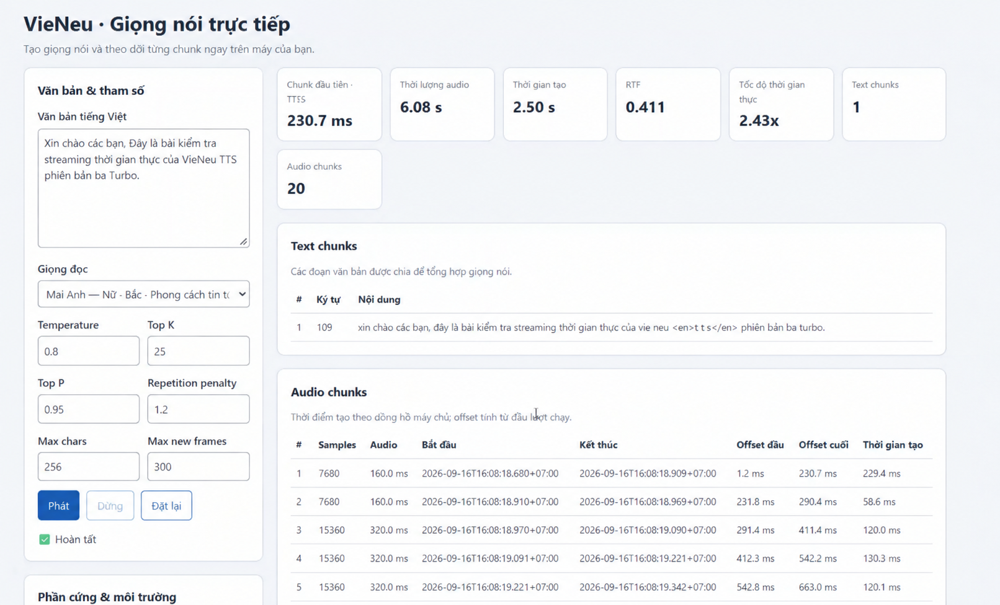

# Báo cáo VieNeu-TTS v3 Turbo: Streaming trên GPU

> Phạm vi báo cáo: mã nguồn nhánh `main` tại commit `1ea13db`, phiên bản package `3.8.1`, cập nhật ngày 17/09/2026.

## 1. Tác giả và tổng quan dự án

VieNeu-TTS do **Phạm Nguyễn Ngọc Bảo** phát triển. Theo tài liệu của dự án, VieNeu-TTS v3 Turbo sử dụng kiến trúc được thiết kế và huấn luyện lại từ đầu trên hơn 10.000 giờ dữ liệu song ngữ Việt–Anh. Hệ thống dùng MOSS Audio Tokenizer Nano để biểu diễn âm thanh và `sea-g2p` để chuyển văn bản thành chuỗi âm vị.

Các khả năng chính của v3 Turbo gồm:

- Tổng hợp tiếng Việt và tiếng Anh ở tần số lấy mẫu 48 kHz.
- 25 giọng dựng sẵn, trong đó có 10 giọng nổi bật.
- Sao chép giọng tức thời từ đoạn tham chiếu khoảng 3–8 giây.
- Điều khiển cảm xúc, hội thoại nhiều người nói và tổng hợp theo batch.
- Streaming thời gian thực trên GPU hoặc CPU, đồng thời có server tương thích OpenAI Audio API.
- Tự chọn backend: PyTorch trên CUDA và ONNX khi chạy CPU.

VieNeu v4 được giới thiệu dưới dạng dịch vụ độc quyền tại `vieneu.io`, không phải model mã nguồn mở có thể chọn trong SDK của repository này. Vì vậy, báo cáo tập trung vào v3 Turbo đang có đầy đủ mã nguồn và cơ chế streaming GPU.

## 2. Các model và chế độ có thể chọn

### 2.1. Dòng model trong tài liệu dự án

| Model | Trạng thái | Môi trường phù hợp | Đặc điểm chính |
|---|---|---|---|
| **VieNeu-TTS v3 Turbo** | Hiện hành, mặc định | GPU CUDA hoặc CPU | Song ngữ, 48 kHz, 25 giọng, clone giọng, cảm xúc, hội thoại và streaming |
| **VieNeu-TTS v3 Nano** | Preview | CPU yếu, edge | ONNX, nhẹ hơn; 24 kHz, 11 giọng, chất lượng và khả năng song ngữ thấp hơn v3 Turbo |
| **VieNeu-TTS v3** | Dự kiến | PyTorch GPU | Chưa phát hành đầy đủ trong repository hiện tại |
| v2, v2-CPU, v2-Turbo, v1 | Ngừng phát triển hoặc deprecated | Tương thích ứng dụng cũ | Không nên dùng cho triển khai mới |

Factory vẫn giữ các mode cũ như `remote`, `api`, `fast`, `gpu`, `turbo`, `turbo_gpu`, `xpu` và `standard` để tương thích ngược. Các mode này không đồng nghĩa với việc tất cả đều là model hiện hành được khuyến nghị.

### 2.2. Backend của v3 Turbo

Khi khởi tạo `Vieneu()` mà không chỉ định backend:

- Máy có CUDA: dùng backend PyTorch trên GPU.
- Máy không có CUDA: dùng backend ONNX trên CPU.

Có thể chỉ định rõ bằng `backend="pytorch"` hoặc `backend="onnx"`. Tham số `precision="fp32" | "int8"` chỉ áp dụng cho ONNX CPU; GPU PyTorch không sử dụng tham số này.

Ví dụ cấu hình GPU:

```python
from vieneu import Vieneu

tts = Vieneu(
    mode="v3turbo",
    backend="pytorch",
    device="cuda",
    max_streams=16,
)
```

`max_streams` là số slot streaming đồng thời được cấp cho bộ lập lịch GPU. Đây là cấu hình của engine, không phải tham số của từng lần gọi `infer_stream()`.

## 3. Luồng tạo âm thanh bằng `infer_stream`

Luồng xử lý tổng quát như sau:

```mermaid
flowchart LR
    A[Văn bản đầu vào] --> B[Chọn voice hoặc ref_audio]
    B --> C[Ngắt đoạn và câu]
    C --> D[Chuẩn hóa văn bản]
    D --> E[Phonemize và đóng gói theo max_chars]
    E --> F[Submit vào GPU scheduler]
    F --> G[Prefill prompt]
    G --> H[Cuda Graph sinh acoustic codes]
    H --> I[MOSS codec batch decode]
    I --> J[Chèn khoảng nghỉ còn thiếu]
    J --> K[Watermark nếu bật]
    K --> L[yield audio float32 48 kHz]
```



Chi tiết từng bước:

1. **Xác định giọng**: hệ thống dùng `voice` dựng sẵn hoặc `ref_audio`. Nếu truyền cả hai, audio tham chiếu trực tiếp được ưu tiên để tạo speaker embedding và mã tham chiếu.
2. **Ngắt văn bản**: văn bản được tách theo đoạn, xuống dòng và dấu kết câu. Kết quả được đóng gói sao cho mỗi text chunk không vượt quá `max_chars` sau chuẩn hóa.
3. **Chuẩn hóa**: số, ký hiệu, chữ viết tắt và phần tiếng Anh được chuyển sang biểu diễn phù hợp trước khi phonemize. Những mẩu quá ngắn có thể được ghép lại để tránh tạo quá nhiều chunk nhỏ.
4. **Phonemize**: `sea-g2p` chuyển text chunk thành chuỗi âm vị dùng làm prompt cho mô hình.
5. **Sinh mã âm thanh**: mỗi chunk được đưa vào GPU scheduler. Prompt được prefill, sau đó backbone sinh các frame acoustic theo từng bước.
6. **Giải mã streaming**: các frame mới được MOSS codec giải mã theo batch và được `yield` thành các mảng NumPy `float32`, mono, 48 kHz.
7. **Nối các text chunk**: hệ thống đo khoảng lặng tự nhiên ở biên và chỉ chèn phần còn thiếu. Mức mục tiêu là khoảng 0,30 giây cho dấu ngắt nhẹ, 0,50 giây cho cuối câu và 0,70 giây cho cuối đoạn.
8. **Watermark**: watermark được áp dụng trên từng audio subchunk khi `apply_watermark=True`.

Khi có nhiều text chunk, chunk kế tiếp được gửi vào scheduler ngay sau khi frame cuối của chunk trước được sinh ra, trong lúc phần đuôi audio vẫn đang được codec giải mã. Cơ chế chồng lấp này giảm khoảng trễ tại điểm nối.

## 4. Các thông số có thể điều chỉnh

### 4.1. Infer stream function

```python
tts.infer_stream(
    text,
    ref_audio=None,
    voice=None,
    style=None,
    denoise=True,
    use_ref_codes=True,
    temperature=0.8,
    top_k=25,
    top_p=0.95,
    max_new_frames=300,
    repetition_penalty=1.2,
    repetition_window=64,
    max_chars=256,
    apply_watermark=True,
)
```

| Thông số | Mặc định | Ý nghĩa và cách tinh chỉnh |
|---|---:|---|
| `text` | Bắt buộc | Văn bản cần tổng hợp. |
| `voice` | `None` | Tên hoặc cấu hình giọng dựng sẵn. |
| `ref_audio` | `None` | Đường dẫn audio clone giọng; thường nên dài khoảng 3–8 giây và có giọng nói rõ. |
| `denoise` | `True` | Khử nhiễu audio tham chiếu trước khi trích đặc trưng. |
| `use_ref_codes` | `True` | Dùng mã âm thanh tham chiếu bên cạnh speaker embedding. |
| `temperature` | `0.8` | Độ ngẫu nhiên khi lấy mẫu. Tăng có thể làm cách đọc đa dạng hơn nhưng kém ổn định hơn. |
| `top_k` | `25` | Chỉ lấy mẫu trong `k` token có xác suất cao nhất. |
| `top_p` | `0.95` | Nucleus sampling; giữ tập token có tổng xác suất đạt ngưỡng này. |
| `repetition_penalty` | `1.2` | Phạt lặp mã âm thanh. Tăng nhẹ khi gặp lặp; giá trị quá cao có thể làm âm thanh thiếu tự nhiên. |
| `repetition_window` | `64` | Số frame lịch sử dùng để phát hiện lặp. GPU scheduler hiện dùng ring buffer cố định khi khởi tạo; giá trị khác nhau theo từng request có thể bị bỏ qua. |
| `max_chars` | `256` | Giới hạn ký tự của một text chunk sau chuẩn hóa. Giá trị nhỏ giảm thời gian chờ prefill nhưng tạo nhiều điểm nối; giá trị lớn giảm số điểm nối nhưng làm chunk đầu nặng hơn. |
| `max_new_frames` | `300` | Trần số frame âm thanh được phép sinh cho một text chunk. Engine còn tự giới hạn theo độ dài phoneme để tránh sinh dư. |
| `apply_watermark` | `True` | Bật watermark cho audio trả về. |
| `style` | — | Đã deprecated và hiện bị bỏ qua. |

Trong giao diện ở `my_test`, `Max chars` được kiểm tra trong khoảng **128–512**, còn `Max new frames` được kiểm tra trong khoảng **1–1200** theo yêu cầu thử nghiệm. Đây là ràng buộc của công cụ thử nghiệm, không phải tuyên bố rằng mọi giá trị trong khoảng đều tối ưu. Điểm khởi đầu hợp lý vẫn là `max_chars=256` và `max_new_frames=300`.

Ví dụ gọi streaming:

```python
for audio_chunk in tts.infer_stream(
    text="Xin chào. Đây là thử nghiệm streaming trên GPU.",
    voice="Mai Anh",
    temperature=0.8,
    top_k=25,
    top_p=0.95,
    repetition_penalty=1.2,
    max_chars=256,
    max_new_frames=300,
):
    # audio_chunk: numpy.ndarray float32, mono, 48 kHz
    send_to_client(audio_chunk)
```

Ngoài tham số theo request, các cấu hình engine quan trọng gồm:

| Cấu hình engine | Vai trò |
|---|---|
| `backend`, `device`, `dtype` | Chọn runtime, thiết bị và kiểu dữ liệu. GPU benchmark chính thức dùng PyTorch `bf16`. |
| `max_streams` | Số request streaming đồng thời tối đa và cũng là kích thước batch/slot được dự trữ trong scheduler. |
| `max_batch_size` | Giới hạn batch của các đường suy luận batch; không thay thế `max_streams` của streaming scheduler. |
| `babble_retries` | Số lần thử lại ở các đường sinh không streaming. GPU stream không retry một hàng đang phát vì audio đã được gửi cho client. |

## 5. GPU: cơ chế streaming

Phần này bám theo cơ chế mới nhất mô tả trong [`docs/streaming.vi.md`](../docs/streaming.vi.md).

### 5.1. Một CUDA Graph với nhiều slot cố định

Scheduler tạo một CUDA Graph có batch cố định `B = max_streams`. Mỗi request đang chạy chiếm một slot. Ở mỗi bước, graph sinh một frame âm thanh tương đương **80 ms** và thực hiện trong cùng lượt replay:

- backbone step;
- acoustic decoder 16 codebook;
- repetition penalty;
- sampling theo `temperature`, `top_k`, `top_p` riêng của từng request.

Theo số đo tham chiếu trên RTX 3060, một graph step mất khoảng 7 ms ở `B=1`, 8 ms ở `B=8`, 9 ms ở `B=16` và 10 ms ở `B=32`.

### 5.2. Continuous batching

Request mới không phải chờ toàn bộ câu của request cũ kết thúc. Scheduler thực hiện prefill prompt, đưa request vào slot trống, căn KV cache theo write cursor chung và tiếp tục graph loop. Khi gặp EOS hoặc đạt giới hạn frame, slot được giải phóng ngay cho request tiếp theo.

Nhờ đó, một tiến trình server có thể phục vụ nhiều luồng đồng thời mà không cần tạo thêm process hoặc nhân bản toàn bộ model.

### 5.3. Shared streaming codec

Acoustic codes của các slot đang hoạt động được gom lại và đưa qua một lần `batch_decode(streaming=True)` của MOSS codec sau mỗi bốn frame. Request mới được giải mã sớm sau hai frame đầu, nên kích thước audio chunk điển hình là:

- chunk đầu: 2 frame = 160 ms;
- các chunk sau: 4 frame = 320 ms.

Codec không dùng look-ahead. Tài liệu dự án ghi nhận sai khác so với full decode khoảng `6e-4`.

### 5.4. Một worker sở hữu GPU

Một worker thread duy nhất sở hữu model và CUDA context. Các lời gọi `infer_stream()` ở thread khác giao tiếp với worker qua queue. Kiến trúc này tránh nhiều process cùng tranh GPU, đồng thời cho phép scheduler gom các request vào chung CUDA Graph và codec batch.

### 5.5. Chi phí và lựa chọn `max_streams`

Kết quả tham chiếu trên RTX 3060 `bf16`:

| Tác vụ | Chi phí tham chiếu |
|---|---:|
| Prefill 1 prompt | khoảng 21 ms |
| Prefill 8 prompt | khoảng 39 ms |
| Prefill 16 prompt | khoảng 73 ms |
| Prefill 32 prompt | khoảng 125 ms |
| Codec mỗi 4 frame | khoảng 65 ms + 2,5 ms cho mỗi slot được dự trữ |

Chi phí codec tăng theo `max_streams` đã cấp phát, không chỉ theo số stream đang hoạt động. Vì vậy, đặt `max_streams=32` trên một dịch vụ thường chỉ có một người dùng vẫn làm tăng độ trễ của người dùng đó.

Khuyến nghị từ benchmark:

- `max_streams=8`: ưu tiên độ trễ thấp.
- `max_streams=16`: cân bằng giữa độ trễ và số luồng, đồng thời là mặc định.
- `max_streams=32`: ưu tiên thông lượng cực đại nhưng gần như không còn biên an toàn thời gian thực ở tải đầy.

`max_streams` nên gần với số stream thực sự hoạt động cùng lúc, không nên đặt cao chỉ để dự phòng.

## 6. TTFA, RTF và Lead

Ba chỉ số đo những khía cạnh khác nhau:

- **TTFA — Time To First Audio**: thời gian từ khi gửi request đến khi nhận được byte audio đầu tiên. Header WAV không được tính là audio.
- **RTF — Real-Time Factor**: thời gian sinh chia cho thời lượng audio. `RTF < 1` nghĩa là tổng thể hệ thống sinh nhanh hơn tốc độ phát thực tế.
- **Lead**: lượng audio client đã nhận trừ thời gian đã trôi kể từ lúc nhận chunk đầu.

Công thức tại thời điểm `t`:

```text
Lead(t) = tổng thời lượng audio đã nhận - (t - thời điểm nhận chunk đầu)
```

Nếu client phát ngay khi nhận chunk đầu:

- `Lead > 0`: client vẫn còn audio trong buffer.
- `Lead = 0`: buffer vừa cạn.
- `Lead < 0`: client cần phát nhưng chưa có dữ liệu mới, vì vậy tiếng có thể bị đứt.

RTF trung bình nhỏ hơn 1 chưa bảo đảm audio luôn liền mạch. Một lần codec hoặc mạng bị trễ cục bộ vẫn có thể làm lead rơi xuống âm. Lead vì thế phản ánh khả năng chịu jitter trực tiếp hơn RTF.

Theo benchmark trong tài liệu mới nhất:

- GPU duy trì lead tối thiểu khoảng **+80 ms** ở mọi mức tải không quá 16 stream.
- CPU có lead-in bốn frame, tương đương khoảng **+320 ms**.
- Client nên **prebuffer 150–300 ms** trước khi bắt đầu phát để hấp thụ jitter mạng và dao động thời gian sinh.

Giao diện thử nghiệm hiện đặt lịch phát trước khoảng 250 ms, nằm giữa khoảng khuyến nghị này.

## 7. Kết quả benchmark tham chiếu của dự án

Với RTX 3060, PyTorch `bf16` và `max_streams=16`, tài liệu dự án công bố:

| Số stream đồng thời | TTFA | RTF | Lead tối thiểu |
|---:|---:|---:|---:|
| 1 | khoảng 115 ms | 0,49 | +160 ms |
| 2 | khoảng 130 ms | 0,51 | +80 ms |
| 4 | khoảng 130 ms | 0,52 | +80 ms |
| 8 | khoảng 164–165 ms | 0,56 | +80 ms |
| 16 | trung vị khoảng 185 ms, tối đa 339 ms | 0,59 | +80 ms |

GPU có thể chuyển sang trạng thái tiết kiệm điện sau khoảng hai giây rảnh. Tài liệu ghi nhận một phép đo tăng từ 118 ms khi GPU đang nóng lên 403 ms sau tám giây rảnh. Vì vậy, TTFA của request đầu tiên sau thời gian nghỉ có thể cao hơn 100–300 ms mà không phản ánh tốc độ ổn định của các request tiếp theo.

Đường streaming cũ trước ngày 15/09/2026 khóa GPU cho toàn bộ utterance, chỉ phục vụ một stream, TTFA khoảng 280–360 ms và RTF khoảng 0,85. Continuous batching và shared codec là thay đổi chính tạo ra kết quả mới.

## 8. Deploy Docker và chạy GPU streaming server của repository gốc

Trước phần thử nghiệm tự xây dựng, cần lưu ý repository của tác giả đã cung cấp sẵn một đường triển khai server cho v3 Turbo. Thành phần trung tâm là [`apps/openai_speech.py`](../apps/openai_speech.py): một ứng dụng FastAPI phục vụ TTS streaming qua endpoint tương thích OpenAI:

```text
POST /v1/audio/speech
```

Ứng dụng sử dụng `Vieneu(mode="v3turbo")`, tự chọn PyTorch GPU hoặc ONNX CPU, rồi chuyển các audio chunk từ `infer_stream()` thành PCM 16-bit để gửi ngay qua HTTP. Client OpenAI SDK, Pipecat, LiveKit hoặc ứng dụng tự viết chỉ cần đổi `base_url`, không cần gọi trực tiếp SDK VieNeu.

### 8.1. Các cách khởi động server

Chạy trực tiếp từ repository:

```bash
# Tự chọn GPU nếu có CUDA, nếu không dùng CPU
uv run python -m apps.openai_speech

# Ép chạy ONNX CPU int8
VIENEU_BACKEND=onnx VIENEU_PRECISION=int8 \
uv run python -m apps.openai_speech
```

Repository đồng thời cung cấp [`docker/docker-compose.yml`](../docker/docker-compose.yml) và các Dockerfile riêng cho GPU/CPU. Hai profile API có thể chạy bằng:

```bash
# Container GPU
docker compose -f docker/docker-compose.yml --profile api-gpu up

# Container CPU
docker compose -f docker/docker-compose.yml --profile api-cpu up
```

Cả hai bind cổng container 8000 ra máy host. Profile `api-gpu` cài backend CUDA và cấp GPU cho container; profile `api-cpu` ép `VIENEU_BACKEND=onnx`, không cần PyTorch CUDA.

### 8.2. Cấu hình vận hành

| Biến môi trường | Mặc định | Vai trò |
|---|---:|---|
| `VIENEU_BACKEND` | `auto` | Chọn `pytorch` hoặc `onnx`. |
| `VIENEU_DEVICE` | `auto` | Chọn `cuda` hoặc `cpu`. |
| `VIENEU_PRECISION` | `fp32` | CPU có thể dùng `int8`; GPU không dùng tham số này. |
| `VIENEU_MAX_STREAMS` | GPU 16; CPU fp32 1, int8 2 | Số request được tổng hợp đồng thời. |
| `VIENEU_QUEUE` | Server trực tiếp: bằng `max_streams`; Docker CPU: 4 | Số request có thể chờ một slot; đầy hàng đợi trả `429`. |
| `VIENEU_QUEUE_TIMEOUT` | 10 giây | Thời gian tối đa chờ slot trước khi trả `429`. |
| `VIENEU_API_KEY` | Trống | Nếu được đặt, client phải gửi Bearer token. |
| `VIENEU_WATERMARK` | `1` | Bật áp dụng watermark cho từng chunk khi dependency khả dụng. |
| `HOST`, `PORT` | `0.0.0.0`, `8000` | Địa chỉ và cổng Uvicorn. |

Server chỉ chạy **một Uvicorn worker**. Model, CUDA context và streaming scheduler đều thuộc tiến trình này; nhiều request GPU được phục vụ bằng continuous batching bên trong scheduler, không phải bằng nhiều process cùng tải model. Khi cần scale ngang, cách phù hợp là chạy nhiều container và gán mỗi container cho một GPU.

Khi startup, server tự tổng hợp câu ngắn `"Xin chào."` để tải ONNX graph hoặc capture CUDA Graph. Nhờ warm-up này, request đầu tiên của client không phải chịu toàn bộ chi phí khởi tạo model.

### 8.3. Luồng request qua server

```mermaid
flowchart LR
    A[OpenAI SDK hoặc HTTP client] --> B[POST /v1/audio/speech]
    B --> C[Kiểm tra API key và JSON]
    C --> D[Admission gate và hàng đợi]
    D --> E[Vieneu.infer_stream]
    E --> F[GPU continuous scheduler]
    F --> G[PCM float32 48 kHz]
    G --> H[Resample nếu được yêu cầu]
    H --> I[PCM s16le hoặc WAV]
    I --> J[HTTP chunked hoặc SSE]
```



Các định dạng được hỗ trợ:

- `response_format="pcm"`: PCM signed 16-bit little-endian, mono, không header.
- `response_format="wav"`: gửi header WAV có độ dài chưa xác định rồi stream PCM.
- `stream_format="audio"`: raw bytes qua chunked response.
- `stream_format="sse"`: từng audio chunk được mã hóa base64 trong sự kiện SSE.
- `sample_rate`: 48.000 Hz gốc hoặc resample theo từng chunk xuống 24.000, 16.000 hay 8.000 Hz.

Ngoài endpoint speech, server có `GET /v1/models`, `GET /v1/voices`, `POST /v1/voices` và `GET /health`. Giọng clone qua `POST /v1/voices` chỉ được giữ trong bộ nhớ tiến trình, vì vậy sẽ mất khi container hoặc server khởi động lại nếu ứng dụng không đăng ký lại.

### 8.4. Lưu ý khi triển khai

- `0.0.0.0` là địa chỉ bind; client cùng máy dùng `http://localhost:8000`.
- Nếu mở server ra mạng, cần đặt `VIENEU_API_KEY` và đặt server sau reverse proxy HTTPS.
- Không tăng số Uvicorn worker để tăng số stream trên cùng GPU; hãy điều chỉnh `VIENEU_MAX_STREAMS`.
- `max_streams` nên sát tải đồng thời thực tế vì codec dự trữ slot theo giá trị này.
- API server hiện chuyển tiếp các tham số sampling và `max_chars`; `max_new_frames` chưa được đưa vào `SpeechRequest`, nên dùng mặc định của `infer_stream()`.

## 9. Thử nghiệm trong thư mục `my_test`

### 9.1. Mục tiêu và công cụ

[`stream_play.py`](./stream_play.py) chạy một dashboard cục bộ để:

- nhập văn bản và chọn giọng;
- điều chỉnh sampling, `Max chars` và `Max new frames`;
- nhận từng audio chunk trực tiếp từ `infer_stream()`;
- phát nối tiếp trên trình duyệt với prebuffer;
- ghi TTFA, thời gian sinh, RTF, tốc độ real-time và timeline của từng chunk.

Ba ảnh dưới đây được giữ nguyên từ lần thử nghiệm trước. Ảnh giao diện còn nhãn **“Ký tự mỗi chunk”** và chưa có ô **“Max new frames”**; phiên bản hiện tại đã đổi nhãn thành **“Max chars”**, thêm **“Max new frames”**, đồng thời kiểm tra `Max chars` trong khoảng 128–512 và `Max new frames` trong khoảng 1–1200.

### 9.2. Phần cứng thử nghiệm


Môi trường trong ảnh gồm WSL2, Intel Core i5-12600KF, khoảng 7,67 GiB RAM, NVIDIA GeForce RTX 5060 với khoảng 7,96 GiB VRAM, Python 3.12.14, PyTorch 2.8.0 CUDA 12.8. Ảnh ghi VieNeu 3.8.0 vì được chụp trước khi repository được cập nhật lên package 3.8.1.

### 9.3. Giao diện trước khi chạy



Cấu hình thể hiện trong ảnh:

- giọng `Mai Anh`;
- `temperature=0.8`;
- `top_k=25`;
- `top_p=0.95`;
- `repetition_penalty=1.2`;
- giới hạn text chunk 256 ký tự.

Đây gần như là bộ thông số mặc định của `infer_stream()`, phù hợp để làm đường cơ sở trước khi tinh chỉnh.

### 9.4. Kết quả chạy



Kết quả hiển thị trong ảnh:

| Chỉ số | Giá trị |
|---|---:|
| TTFA | 230,7 ms |
| Thời lượng audio | 6,08 giây |
| Thời gian sinh | 2,50 giây |
| RTF | 0,411 |
| Tốc độ | 2,43 lần real-time |
| Text chunks | 1 |
| Audio chunks | 20 |

`RTF = 2,50 / 6,08 ≈ 0,411`, và tốc độ real-time là nghịch đảo của RTF, xấp xỉ `2,43×`. Hệ thống do đó sinh toàn bộ audio nhanh hơn đáng kể so với thời gian phát.

Một text chunk tạo ra 20 audio chunk là hành vi bình thường: **text chunk** là đơn vị ngắt và phonemize văn bản, còn **audio chunk** là các đợt frame codec được trả dần cho client.

Các hàng đầu của timeline cũng phản ánh cơ chế codec mới:

- chunk đầu có 7.680 sample = 160 ms = 2 frame;
- chunk thứ hai cũng có 7.680 sample;
- các chunk tiếp theo có 15.360 sample = 320 ms = 4 frame.

Nếu dùng thời điểm kết thúc server ghi trong ảnh để ước lượng và bỏ qua độ trễ mạng, lead của năm chunk đầu là:

| Sau chunk | Audio đã nhận | Thời gian từ chunk đầu | Lead ước lượng |
|---:|---:|---:|---:|
| 1 | 160 ms | 0 ms | +160,0 ms |
| 2 | 320 ms | 59,7 ms | +260,3 ms |
| 3 | 640 ms | 180,7 ms | +459,3 ms |
| 4 | 960 ms | 311,9 ms | +648,1 ms |
| 5 | 1.280 ms | 432,3 ms | +847,7 ms |

Lead tăng vì các chunk 320 ms được sinh trong khoảng 120–130 ms. Đây là dấu hiệu hệ thống đang tạo buffer nhanh hơn tốc độ phát. Tuy nhiên, con số này là ước lượng tại server; lead thực tế ở trình duyệt còn chịu ảnh hưởng của truyền dữ liệu, lịch JavaScript, giải mã audio và thiết bị phát.

TTFA 230,7 ms không nên so trực tiếp với số 105–115 ms của benchmark chính thức một stream: máy thử nghiệm dùng RTX 5060 qua WSL2 và dashboard trình duyệt, ảnh được chụp trên phiên bản cũ hơn, đồng thời trạng thái nóng/lạnh của GPU chưa được kiểm soát. Một benchmark so sánh cần warm-up, cố định commit, cùng cấu hình `max_streams`, lặp nhiều lần và báo cáo median cùng percentile.

## 10. Kết nối VieNeu với Google ADK trên Google Colab

Notebook [`VieNeu_Google_ADK_Colab.ipynb`](./VieNeu_Google_ADK_Colab.ipynb) được bổ sung để kiểm thử một kịch bản tích hợp agent: Google ADK nhận yêu cầu bằng ngôn ngữ tự nhiên, Gemini quyết định gọi function tool, còn VieNeu-TTS chịu trách nhiệm tạo âm thanh trên GPU Colab.

Mục tiêu của notebook không phải thay thế server do tác giả cung cấp. Notebook tái sử dụng chính `apps.openai_speech` làm lớp TTS, sau đó đặt Google ADK ở phía client/orchestration.

### 10.1. Các thành phần

| Thành phần | Vai trò |
|---|---|
| Google Colab GPU | Chạy backend PyTorch CUDA của VieNeu-TTS. |
| `apps.openai_speech` | Cung cấp VieNeu qua HTTP tại `127.0.0.1:8000`. |
| Google ADK `Agent` | Nhận prompt, chọn và truyền tham số cho tool. |
| `synthesize_speech()` | Function tool gọi `/v1/audio/speech`, nhận PCM và lưu WAV. |
| `Runner` + `InMemorySessionService` | Thực thi agent và lưu hội thoại trong RAM của notebook. |
| Gemini API | Mô hình ngôn ngữ quyết định lúc nào cần gọi TTS; không trực tiếp sinh audio VieNeu. |

ADK và VieNeu server chạy trong cùng Colab runtime, vì vậy notebook gọi `localhost` và không cần Cloudflare Tunnel, ngrok hay công khai cổng 8000.

### 10.2. Luồng kết nối

```mermaid
flowchart LR
    A[Prompt người dùng] --> B[Google ADK Agent]
    B --> C[Gemini chọn function tool]
    C --> D[synthesize_speech]
    D --> E[POST localhost:8000/v1/audio/speech]
    E --> F[VieNeu infer_stream trên GPU]
    F --> G[PCM chunks 48 kHz]
    G --> H[Ghi file WAV]
    H --> I[ADK nhận metadata]
    I --> J[IPython Audio phát kết quả]
```



Luồng này tách hai trách nhiệm rõ ràng:

- **Google ADK/Gemini** là tầng điều phối: hiểu ý định, chọn giọng và gọi tool.
- **VieNeu-TTS** là tầng tổng hợp giọng nói: chuẩn hóa text, phonemize, sinh frame và giải mã audio trên GPU.

Nội dung người dùng không được Gemini đọc thành tiếng bằng TTS của Google. Gemini chỉ gửi chuỗi `text` và `voice` vào `synthesize_speech()`, sau đó tool gọi server VieNeu.

### 10.3. Các bước trong notebook

1. Kiểm tra Colab đã được cấp NVIDIA GPU.
2. Cài `uv`, Google ADK 2.x và các dependency tối thiểu.
3. Clone repository mới nhất và chạy `uv sync --extra cuda`.
4. Khởi động `apps.openai_speech` bằng `subprocess.Popen` để server chạy nền, không khóa cell.
5. Poll `GET /health` tối đa 10 phút trong lúc model tải và warm-up.
6. Gọi VieNeu API trực tiếp trước để tách lỗi TTS khỏi lỗi ADK/Gemini.
7. Đọc `GOOGLE_API_KEY` từ Colab Secrets; chỉ dùng `getpass` làm phương án dự phòng.
8. Khai báo hàm `synthesize_speech(text, voice)` và đăng ký trực tiếp trong `tools=[...]`. ADK tự bọc hàm Python thành `FunctionTool` dựa trên tên, type hint và docstring.
9. Tạo session trong RAM, chạy prompt bằng `Runner.run_async()`, nhận kết quả tool và phát WAV bằng `IPython.display.Audio`.

Notebook còn cung cấp cell xem log server và cell dừng process sau khi thử nghiệm. File không lưu output thực thi hoặc API key bên trong metadata.

Tại thời điểm lập báo cáo, notebook yêu cầu `google-adk>=2,<3`; cấu trúc `Agent`, function tool, `Runner` và `InMemorySessionService` đã được smoke-test với Google ADK 2.9.1.

### 10.4. Function tool gọi VieNeu

Tool gửi request với cấu hình cơ bản:

```json
{
  "model": "vieneu-v3-turbo",
  "input": "Nội dung cần đọc",
  "voice": "Mai Anh",
  "response_format": "pcm",
  "sample_rate": 48000
}
```

Response PCM được đọc dần bằng `iter_content()`. Thời điểm nhận block PCM đầu tiên được dùng để tính TTFA; các block sau được ghi vào WAV mono 16-bit, 48 kHz. Khi hoàn tất, tool trả cho ADK một dictionary gồm trạng thái, request ID, đường dẫn file, TTFA, thời lượng audio và tổng thời gian xử lý.

Tool cố ý chỉ có hai tham số `text` và `voice`. Giao diện nhỏ giúp mô hình gọi function ổn định hơn và không đưa các thông số vận hành nội bộ của VieNeu vào prompt.

### 10.5. Kết quả kiểm tra và lỗi đã quan sát

Phần khởi động trên Colab đã tải v3 Turbo bằng backend PyTorch, capture scheduler và đưa server đến trạng thái sẵn sàng với `max_streams=16`. Notebook kiểm tra `/health` trước khi cho phép tiếp tục, nên lỗi server/model loading được tách khỏi lỗi agent.

Trong một lần chạy phần ADK, Gemini API trả:

```text
503 UNAVAILABLE
This model is currently experiencing high demand.
```

Traceback cho thấy lỗi phát sinh trong `google.genai.models.generate_content()` trước khi ADK gọi `synthesize_speech()`. Vì vậy đây là lỗi năng lực phục vụ tạm thời của Gemini, không phải lỗi `infer_stream()`, VieNeu server, CUDA hay function tool. Cảnh báo `JSON_SCHEMA_FOR_FUNC_DECL is enabled` chỉ cho biết ADK đang dùng tính năng schema thử nghiệm và không phải nguyên nhân dừng chương trình.

Biện pháp vận hành phù hợp:

- retry lỗi `429`, `503` hoặc các lỗi `5xx` bằng exponential backoff có jitter và giới hạn số lần;
- ưu tiên tên model stable cụ thể thay cho alias `gemini-flash-latest` nếu cần tính ổn định;
- kiểm tra key riêng bằng endpoint liệt kê model trước khi chạy ADK;
- không retry tự động các lỗi `400` hoặc `403`, vì chúng thường liên quan request, credential hoặc quyền truy cập.

API key đã từng được dán vào hội thoại phải được thu hồi và thay bằng key mới. Báo cáo và notebook không lưu lại giá trị key đó. Key mới cần được đặt trong Colab Secrets với tên `GOOGLE_API_KEY`.

### 10.6. Giới hạn của thử nghiệm ADK hiện tại

VieNeu server vẫn tạo và truyền PCM theo từng chunk, nhưng function tool chỉ trả quyền điều khiển cho agent sau khi toàn bộ response đã được ghi thành WAV. Vì vậy demo này xác nhận **kết nối ADK → VieNeu server và quá trình sinh audio**, chưa phải trải nghiệm voice agent phát từng chunk ngay khi nhận.

Muốn phát real-time đầu-cuối, client phải tiêu thụ PCM song song trong lúc HTTP response còn mở, đưa từng chunk vào audio playback buffer có prebuffer 150–300 ms, đồng thời tách việc phát audio khỏi thời điểm function tool trả kết quả cho Gemini.

## 11. Kết luận và khuyến nghị triển khai

VieNeu-TTS v3 Turbo đạt streaming GPU bằng cách kết hợp continuous batching, một CUDA Graph có nhiều slot, KV cache dạng ring và MOSS codec dùng chung. Cách tổ chức này cho phép request mới tham gia khi các request cũ vẫn đang chạy, thay vì khóa GPU đến hết utterance.

Repository gốc đã cung cấp đầy đủ đường chạy trực tiếp, Docker GPU/CPU và OpenAI-compatible API. Phần thử nghiệm trong báo cáo mở rộng đường triển khai đó theo hai hướng: dashboard local để quan sát từng audio chunk và notebook Colab để Google ADK gọi VieNeu như một function tool. ADK bổ sung khả năng điều phối bằng ngôn ngữ tự nhiên nhưng không thay đổi cơ chế streaming GPU bên trong VieNeu.

Thiết lập khởi đầu nên dùng:

```text
backend=pytorch, device=cuda
max_streams=8 nếu ưu tiên độ trễ; 16 nếu cần cân bằng tải
temperature=0.8, top_k=25, top_p=0.95
repetition_penalty=1.2
max_chars=256, max_new_frames=300
client prebuffer=150–300 ms
```

## Tài liệu và mã nguồn tham chiếu

- [README tiếng Việt](../README.vi.md)
- [Tài liệu streaming chính thức](../docs/streaming.vi.md)
- [OpenAI-compatible streaming server](../apps/openai_speech.py)
- [Docker Compose GPU/CPU](../docker/docker-compose.yml)
- [Dockerfile GPU](../docker/Dockerfile.gpu)
- [Dockerfile CPU](../docker/Dockerfile.cpu)
- [Factory và các mode](../src/vieneu/factory.py)
- [API v3 Turbo và `infer_stream`](../src/vieneu/v3turbo.py)
- [GPU streaming scheduler](../src/vieneu/v3_turbo_serve/stream.py)
- [CUDA Graph fused frame](../src/vieneu/v3_turbo_serve/fused.py)
- [Chuẩn hóa và phonemize văn bản](../src/vieneu_utils/phonemize_text.py)
- [Dashboard thử nghiệm](./stream_play.py)
- [Hướng dẫn chạy thử nghiệm](./HUONG_DAN_CHAY.md)
- [Notebook VieNeu + Google ADK trên Colab](./VieNeu_Google_ADK_Colab.ipynb)
- [Google ADK Python quickstart](https://adk.dev/get-started/python/)
- [Google ADK function tools](https://adk.dev/tools-custom/function-tools/)
- [Gemini API troubleshooting](https://ai.google.dev/gemini-api/docs/troubleshooting)
